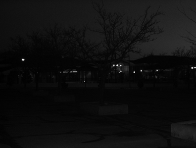
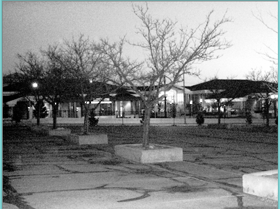

##Image Enhancement

calculate histogram array
```C++
for(int i=0;i<image.rows;i++)
	{
		for(int j=0;j<image.cols;j++)
		{
			histogram[image.at<uchar>(i,j)]++;

		}
	}
```
Night Image



Enhanced Night Image




